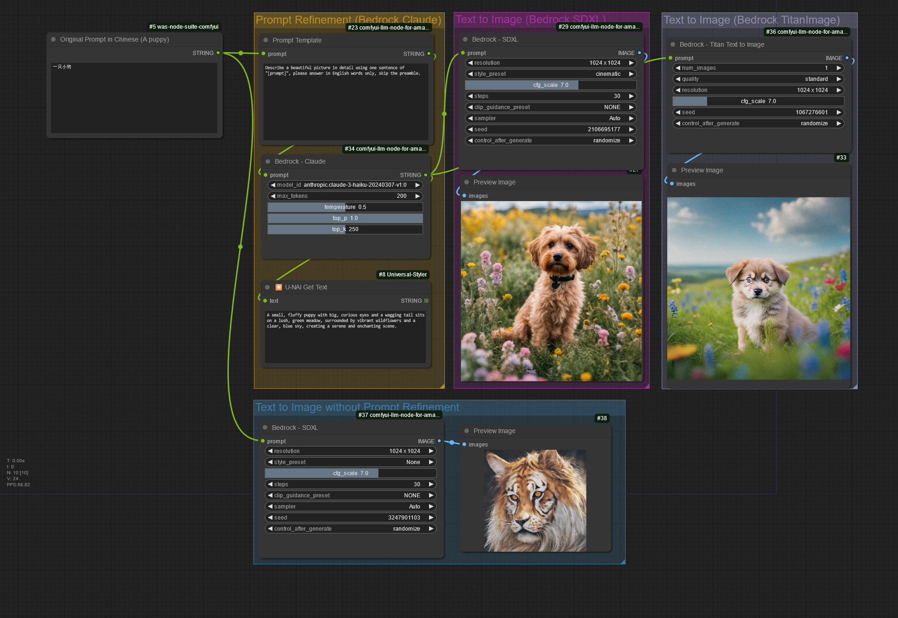
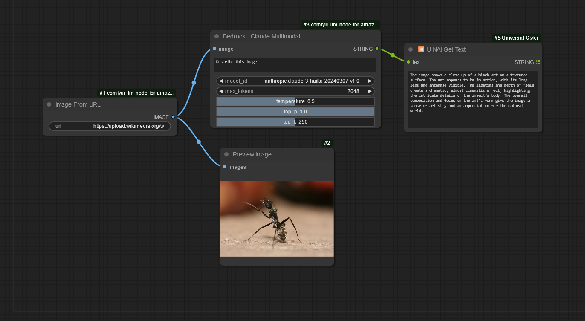
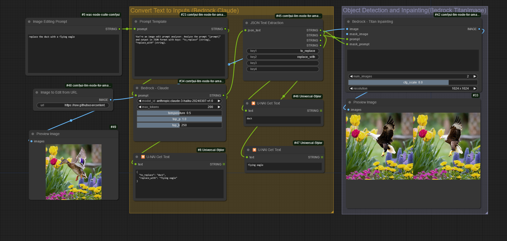
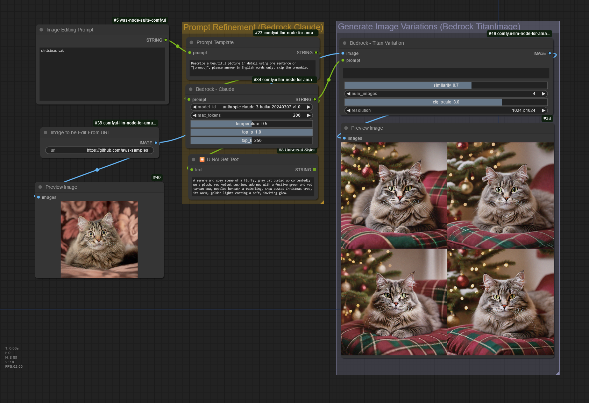
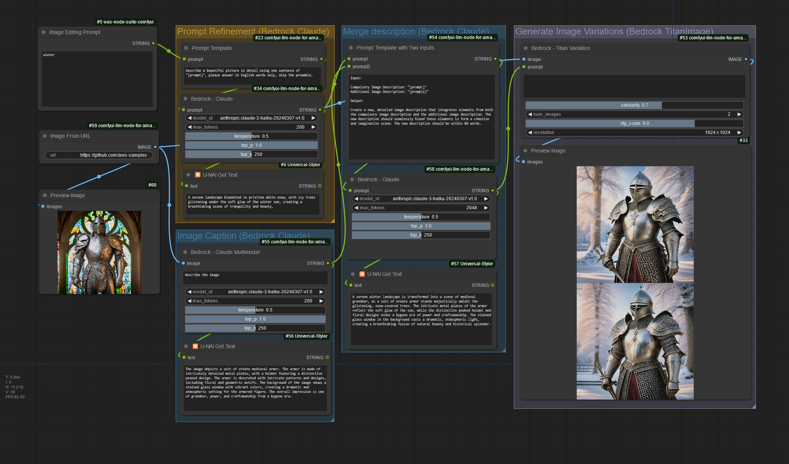

# Amazon Bedrock integration into ComfyUI

Thanks to a dedicated and [publicly available custom node](https://github.com/aws-samples/comfyui-llm-node-for-amazon-bedrock/), it is possible to invoke foundation models from Amazon Bedrock in ComfyUI.

## Supported models:

Here are models and features currently supported.

- Anthropic:

  - Claude (1.x, 2.0, 2.1, Haiku, Sonnet, Opus)

- Amazon:

  - Titan Image Generator G1 (1.x)
    - text to image
    - inpainting
    - outpainting
    - image variation

- Stability AI:

  - Stable Diffusion XL (1.0)
    - text to image

## Examples

Workflow examples are available [here for download](./workflows). 
To import these workflows, click "Load" in the ComfyUI UI, go to workflows directory and choose the one to experiment with.

### Text to image with prompt translation and refinement
Automatically refine the text prompt to generate high quality images.

Download [this workflow file](workflows/text2img_with_prompt_refinement.json) or the image below and load in ComfyUI.

You can use the Bedrock LLM to refine and translate the prompt. It then utilize the image generation model (eg. SDXL, Titan Image) provided by Bedrock.
The result is much better after preprocessing of prompt compared to the original SDXL model (the bottom output in figure) which doesn't have the capability of understanding Chinese.

### Image Caption with Claude 3

Generate captions of a provided image.

Download [this workflow file](workflows/claude3_image_caption.json) or the image below and load in ComfyUI.

This workflow uses Bedrock Claude 3 multimodal to caption image.

### Inpainting with natural language
Use natural language to describe an item in the image and replace it. 

Download [this workflow file](workflows/inpainting_with_natural_language.json) or the image below and load in ComfyUI.

This workflow leverages Claude3 to analyze the replacement information in the prompt. Additionally, it utilizes Bedrock Titan Image to detect objects with text and perform inpainting in a single step.

### Generate Image Variation
Use natural language to generate variation of an image.

Download [this workflow file](workflows/generate_image_variation.json) or the image below and load in ComfyUI.

This workflow begins by using Bedrock Claude3 to refine the image editing prompt. It then utilizes Bedrock Titan Image's variation feature to generate similar images based on the refined prompt.

### Generate Image Variation with Image Caption
Use natural language to generate variation of an image without re-describing the original image content.

Download [this workflow file](workflows/variation_with_caption.json) or the image below and load in ComfyUI.

This workflow begins by using Bedrock Claude3 to refine the image editing prompt, generation caption of the original image, and merge the two image description into one. It then utilizes Bedrock Titan Image's variation feature to generate similar images based on the refined prompt.

